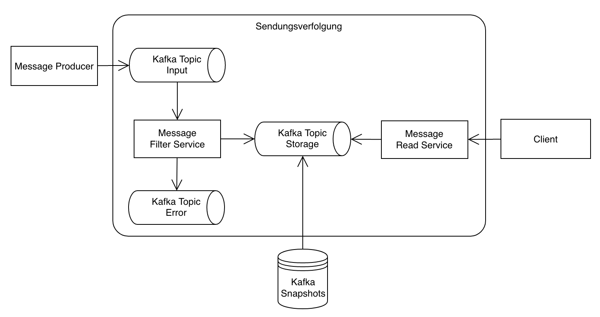

# BA-Projekt: Sendungsverfolgungssystem

For deployment in AKS-cluster:

0. Create new App registration in Azure Portal

1. Set Azure environment:
    cd terraform/scripts
    sh set_environment_variables.sh <subscription_id> <client_id> <client_secret> <tenant_id>

2. Log in to Azure account:
    az login

3. Deploy infrastructure:
    cd terraform/<global / scenarios>
    cd <component>
    terraform init
    terraform apply --auto-approve

4. Compile Project:
    cd Message<Read / Filter>Service
    mvn clean package

5. Make Docker image and push to Azure container registry
    docker build -t <registry_name>.azurecr.io/message-<read / filter>-service .
    az acr login -n <registry_name>
    docker push <registry_name>.azurecr.io/message-<read / filter>-service

6. Get Kubeconfig for created cluster
    az aks get-credentials --resource-group tracking_resources --name tracking-aks-cluster-<random_number>

7. Install services into AKS-cluster with Helm:
    helm install message-<read / filter>-service helm/message<Read / Filter>Service

htpasswd -nbBC 10 mrs-admin mrs-password

openssl req -x509 -nodes -days 365 -newkey rsa:2048 -keyout tls.key -out tls.crt -subj "/CN=<hostname>"
kubectl -n default create secret tls traefik-tls-cert --key=tls.key --cert=tls.crt